Vulkan Grass Rendering
==================================

**University of Pennsylvania, CIS 565: GPU Programming and Architecture, Project 5**

* Yiding Tian
* Tested on: Windows 11, i9-13900H @ 4.1GHz 32GB, RTX 5080 16GB (Personal laptop with external desktop GPU via NVMe connector running in PCIe 4.0x4)

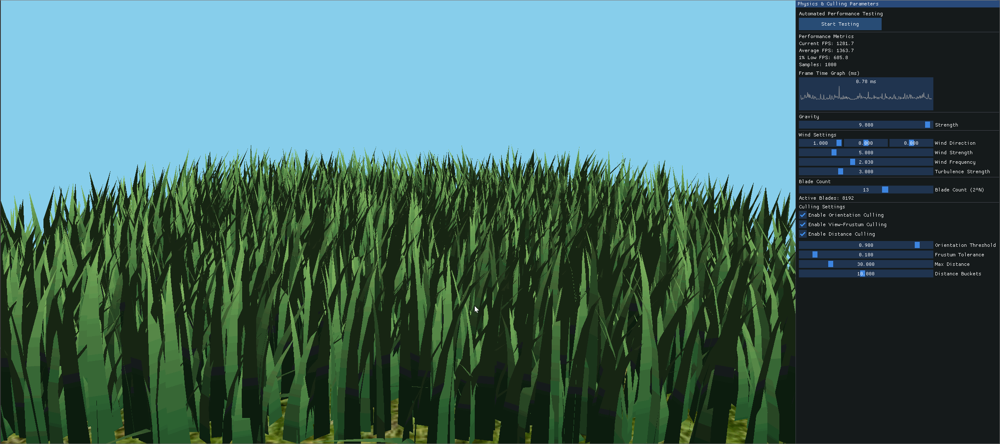

### Overview

This project is a real-time grass renderer implemented in Vulkan, based on the paper [*Responsive Real-Time Grass Rendering for General 3D Scenes*](https://www.cg.tuwien.ac.at/research/publications/2017/JAHRMANN-2017-RRTG/JAHRMANN-2017-RRTG-draft.pdf) by Jahrmann and Wimmer. The renderer simulates and renders large fields of grass blades (up to 1 million blades) at interactive frame rates by leveraging the GPU's parallel processing capabilities through Vulkan's compute and graphics pipelines.

**Technical Architecture:**

The grass rendering system uses a two-pipeline approach:

1. **Compute Pipeline**: Each grass blade is represented as a quadratic Bezier curve with three control points (v0, v1, v2). In the compute shader, physics forces (gravity, recovery, and wind) are applied to simulate realistic grass motion. The shader also performs three types of culling tests (orientation, view-frustum, and distance) to eliminate blades that won't contribute to the final image, dramatically improving performance.

2. **Graphics Pipeline**: Non-culled blades are passed to a tessellation-based graphics pipeline that dynamically generates quad geometry from the Bezier curves. The tessellation evaluation shader positions vertices along the curve with appropriate width tapering, creating natural-looking grass blade shapes. A fragment shader applies Lambert shading for realistic lighting.

**Key Implementation Highlights:**

* **Physics Simulation**: Grass blades respond to environmental forces including scaled gravity, recovery forces (Hooke's law), and wind with both directional and turbulent components
* **State Validation**: Constraints ensure blades remain above ground and maintain proper length throughout simulation
* **Intelligent Culling**: Three complementary culling techniques reduce rendering load by up to 70% while maintaining visual fidelity
* **Hardware Tessellation**: Dynamic level-of-detail tessellation generates appropriate geometry density based on blade complexity
* **Real-time Performance Tools**: Custom ImGui interface enables interactive parameter tuning, live performance monitoring (average FPS, 1% lows, frame time graphs), and automated performance testing with CSV export and Python-based analysis

The renderer can handle blade counts from 1 to over 1 million (2^20) with interactive frame rates on modern GPUs, making it suitable for real-time applications like games and simulations.

## Build Changes

Updated various CMakeLists.txt to minimum v3.10. Included ImGUI in build configuration.

## Core Features

### Grass Tessellation

#### Grass as Bezier Curves


Each grass blade is represented as a quadratic Bezier curve defined by three control points stored in a compact data structure ([Blades.h](src/Blades.h#L15-L24)):

```cpp
struct Blade {
    vec4 v0;  // Position (xyz) + orientation θ (w)
    vec4 v1;  // Bezier guide (xyz) + height (w)
    vec4 v2;  // Physical tip (xyz) + width (w)
    vec4 up;  // Up vector (xyz) + stiffness (w)
};
```

* **v0**: The blade's base position fixed to the ground. The w component stores the orientation angle θ around the up axis
* **v1**: The middle Bezier control point that shapes the blade's curvature. The w component stores the blade's maximum height
* **v2**: The blade tip that moves with physics forces. The w component stores the blade's width for rendering
* **up**: The local up direction defining the blade's "resting" upright orientation. The w component stores the stiffness coefficient

This Bezier representation allows smooth, curved grass blades while requiring only 64 bytes per blade. The quadratic curve formula `P(t) = (1-t)² * v0 + 2(1-t)t * v1 + t² * v2` generates natural-looking shapes.


#### Vulkan Tessellation Pipeline


The graphics pipeline uses **hardware tessellation** to dynamically generate blade geometry from Bezier curves ([grass.tesc](src/shaders/grass.tesc), [grass.tese](src/shaders/grass.tese)):

**1. Vertex Shader ([grass.vert](src/shaders/grass.vert))**: Transforms Bezier control points from model to world space and passes them to the tessellation stage.

**2. Tessellation Control Shader ([grass.tesc](src/shaders/grass.tesc#L35-L47))**: Computes distance-based level-of-detail:

```glsl
vec3 to_camera = blade_root - camera_position;
float ground_distance = length(to_camera - up_direction * dot(to_camera, up_direction));

float tess_level = max_tess_level * exp(-falloff_rate * ground_distance);
tess_level = clamp(tess_level, min_tess_level, max_tess_level);
```

* Close blades: High tessellation (10 subdivisions) for detailed curves
* Distant blades: Low tessellation (2 subdivisions) to reduce geometry load
* Exponential falloff creates smooth LOD transitions

**3. Tessellation Evaluation Shader ([grass.tese](src/shaders/grass.tese#L18-L50))**: Generates quad vertices by evaluating the Bezier curve using de Casteljau's algorithm:

```glsl
// Evaluate Bezier curve at parameter v (0=base, 1=tip)
vec3 a = mix(p0, p1, v);
vec3 b = mix(p1, p2, v);
vec3 c = mix(a, b, v);  // Point on curve

// Generate width by offsetting perpendicular to curve
vec3 c0 = c - width * theta;  // Left edge
vec3 c1 = c + width * theta;  // Right edge
```

The shader creates a quad strip along the curve by interpolating between left and right edges, with natural width tapering toward the tip.

**4. Fragment Shader ([grass.frag](src/shaders/grass.frag#L14-L31))**: Applies Lambert shading with gradient coloring:

```glsl
vec3 grass_base = vec3(0.15, 0.4, 0.2);  // Dark green at base
vec3 grass_tip = vec3(0.55, 0.75, 0.4);  // Light green at tip
vec3 base_color = mix(grass_base, grass_tip, in_v);

vec3 final_color = ambient + diffuse * base_color * 0.75;
```

This creates realistic grass appearance with darker bases and lighter tips catching more light.

### Force Simulation

The compute shader ([compute.comp](src/shaders/compute.comp)) applies physics forces each frame to simulate realistic grass motion. All forces act on the blade tip (v2), with constraints ensuring physical plausibility.

#### Gravity

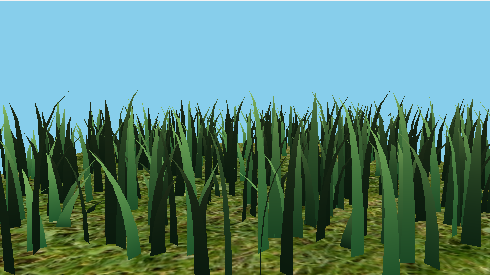

Gravity pulls blades downward with two components ([compute.comp#L95-L106](src/shaders/compute.comp#L95-L106)):

```glsl
vec3 gE = vec3(0.0, -gravityStrength, 0.0);  // Environmental gravity
vec3 gF = 0.25 * length(gE) * f;             // Front-facing gravity
vec3 gravity = gE + gF;
```

* **Environmental gravity (gE)**: Standard downward force
* **Front-facing gravity (gF)**: Scaled component in the blade's facing direction (perpendicular to curve plane), causing blades to droop forward naturally
* The 0.25 scaling factor prevents excessive bending that would look unrealistic

The `f` vector is computed as the cross product of the blade's facing direction and up vector, ensuring gravity acts naturally on the blade's geometry.

#### Recovery

Recovery force restores blades toward their upright position using Hooke's law ([compute.comp#L108-L110](src/shaders/compute.comp#L108-L110)):

```glsl
vec3 iv2 = v0 + up * height;              // Initial upright tip position
vec3 recoveryForce = (iv2 - v2) * stiffness;
```

* `iv2` is where the blade tip would be if standing perfectly upright
* The force is proportional to displacement: `F = k * Δx` (Hooke's law)
* `stiffness` coefficient (0.1-1.5) varies per blade, creating natural variation:
  * Low stiffness: Floppy blades that sway dramatically
  * High stiffness: Rigid blades that quickly snap back upright

This force ensures blades don't collapse permanently under gravity or wind.

#### Wind

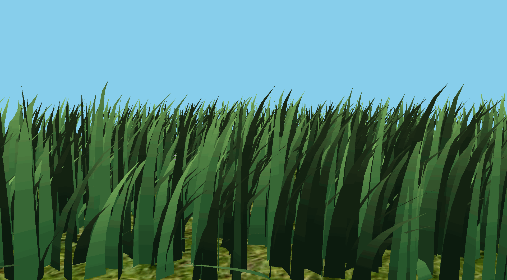

Wind simulation combines directional wind with turbulence for realistic motion ([compute.comp#L113-L157](src/shaders/compute.comp#L113-L157)):

**Directional Wind with Spatial Variation**:

```glsl
vec2 spatialCoord = v0.xz * 0.08;
float gust1 = sin(spatialCoord.x * 4.2 + totalTime * 0.7);
float gust2 = cos(spatialCoord.y * 3.1 + totalTime * 0.5);
float gustStrength = 0.6 + 0.4 * gust1 * gust2;

vec3 windVel = windDirection * windMagnitude * gustStrength;
```

Spatial waves create visible gusts rolling across the grass field rather than uniform wind everywhere.

**Turbulence**:

```glsl
turbulence.x = sin(totalTime * turbFreq * 1.2 + v0.x * 0.15);
turbulence.z = cos(totalTime * turbFreq * 0.85 + v0.z * 0.15);
turbulence *= turbAmp;
```

High-frequency noise creates the chaotic, swirling motion characteristic of wind.

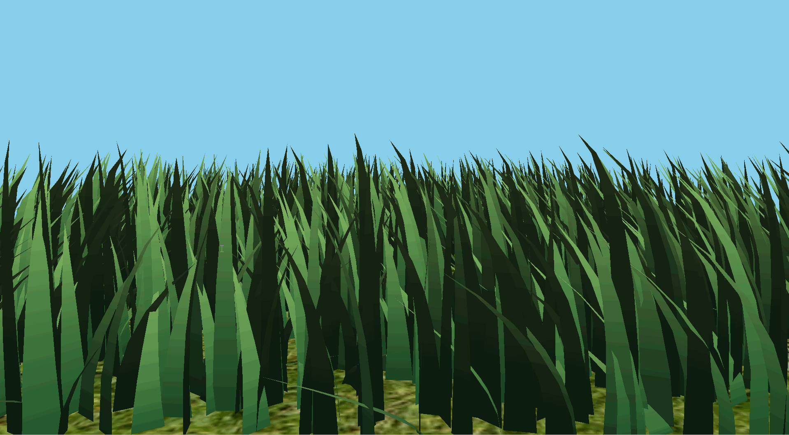

**Drag-Based Application**:

```glsl
float alignment = dot(bladeOrientation, windNormalized);
float sidewaysEffect = 1.0 - abs(alignment);  // Max when perpendicular

float heightRatio = bladeHeight / height;
windForce = windVel * sidewaysEffect * heightRatio;
```

* Wind pushes blades **sideways** (perpendicular to blade) rather than in the wind direction
* Taller, more exposed blade portions catch more wind (`heightRatio`)
* Already-bent blades experience less force (`sidewaysEffect`)

This creates physically plausible wind interaction where blades bend away from wind direction.

### State Validation

After applying forces, the compute shader enforces physical constraints to prevent unrealistic deformation ([compute.comp#L163-L185](src/shaders/compute.comp#L163-L185)):

**1. Above-Ground Constraint**:

```glsl
v2 = v2 - up * min(dot(up, v2 - v0), 0.0);
```

Ensures the blade tip never goes below the ground plane by projecting it back onto the ground.

**2. Length Conservation**:

```glsl
float L0 = length(v2 - v0);
float L1 = length(v1 - v0) + length(v2 - v1);
float L = (2.0 * L0 + L1) / 3.0;

float r = (L > 0.0001) ? (height / L) : 1.0;
v1 = v0 + r * (v1 - v0);
v2 = v1 + r * (v2 - temp);
```

* Measures the blade's arc length (L0: straight distance, L1: curved distance)
* Computes weighted average length L
* Scales control points to maintain the blade's original height
* Prevents blades from stretching or compressing unnaturally

**3. Bezier Curve Correction**:

```glsl
float lProj = length(v2 - v0 - up * dot(up, v2 - v0));
v1 = v0 + height * up * max(1.0 - lProj / height, 0.05 * max(lProj / height, 1.0));
```

Adjusts v1's position to maintain smooth Bezier curve shape based on v2's horizontal displacement.

These constraints ensure blades remain physically plausible regardless of force magnitudes.

### Culling

The compute shader performs three culling tests to eliminate non-visible blades before rendering, dramatically improving performance ([compute.comp#L191-L257](src/shaders/compute.comp#L191-L257)). Only blades passing all enabled tests are written to the output buffer.

#### Orientation Culling

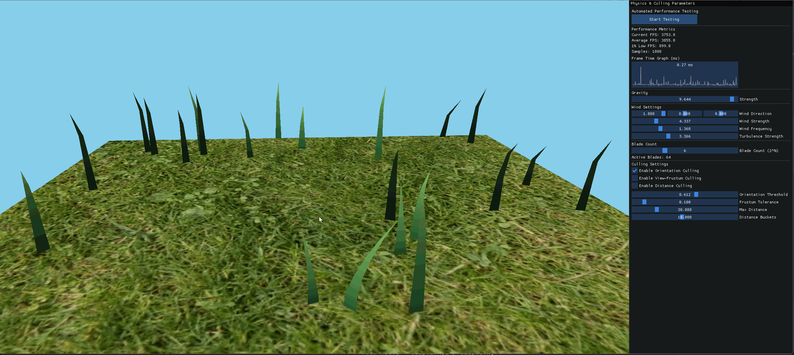

Culls blades oriented edge-on to the camera (thin profile, barely visible) ([compute.comp#L196-L206](src/shaders/compute.comp#L196-L206)):

```glsl
vec3 viewDir = normalize(cameraPos - v0);
if (abs(dot(theta, viewDir)) > orientationThreshold) {
    culled = true;
}
```

* `theta`: Blade's facing direction (perpendicular to curve plane)
* `dot(theta, viewDir)`: Measures alignment
  * ≈ 0: Blade faces camera directly (full width visible)
  * ≈ ±1: Blade is edge-on (thin sliver visible)
* `threshold = 0.9`: Culls blades within ~25° of edge-on orientation


#### View-Frustum Culling

Culls blades outside the camera's view frustum (not visible on screen) ([compute.comp#L208-L233](src/shaders/compute.comp#L208-L233)):

```glsl
vec4 clipV0 = camera.proj * camera.view * vec4(v0, 1.0);
vec4 clipV2 = camera.proj * camera.view * vec4(v2, 1.0);

vec3 ndcV0 = clipV0.xyz / clipV0.w;  // Perspective divide
vec3 ndcV2 = clipV2.xyz / clipV2.w;

bool outsideLeft = (ndcV0.x < -1.0 - tolerance) && (ndcV2.x < -1.0 - tolerance);
// ... check all 6 frustum planes
```

* Transforms blade endpoints (v0, v2) to normalized device coordinates (NDC)
* NDC range is [-1, 1] for visible region
* Culls only if **both** endpoints are outside the **same** frustum plane
* `tolerance = 0.1`: Small margin prevents popping at screen edges


#### Distance Culling

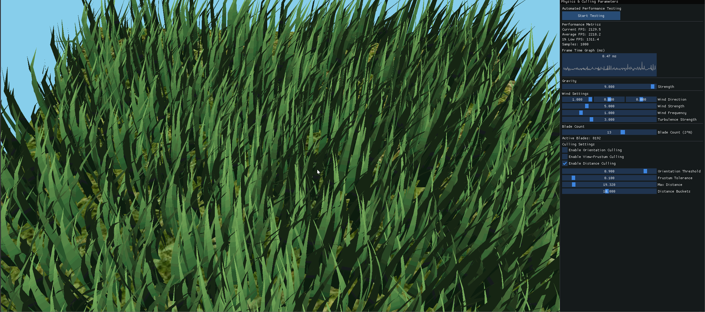

Implements **probabilistic distance-based culling** to reduce density of distant grass ([compute.comp#L235-L252](src/shaders/compute.comp#L235-L252)):

```glsl
float distanceToCamera = length(cameraPos - v0);

if (distanceToCamera > maxDistance) {
    culled = true;
} else {
    int bucketIndex = int(floor(numBuckets * distanceToCamera / maxDistance));
    float hash = fract(sin(dot(v0.xz, vec2(12.9898, 78.233))) * 43758.5453);
    float cullThreshold = 1.0 - (float(bucketIndex) / numBuckets);

    if (hash > cullThreshold) {
        culled = true;
    }
}
```

* Divides view distance into buckets (default: 10)
* **Bucket 0 (nearest)**: Keep 100% of blades
* **Bucket 5 (mid-range)**: Keep ~50% of blades
* **Bucket 9 (farthest)**: Keep ~10% of blades
* Uses stable hash based on blade position (same blade always hashed to same value)
* Prevents temporal flickering while creating smooth density falloff

**Example**: With `maxDistance = 50.0` and `numBuckets = 10`:
* 0-5 units: Keep all blades
* 25-30 units: Keep 40% of blades
* 45-50 units: Keep 10% of blades
* Beyond 50 units: Cull all blades

The hash function ensures even distribution without visible patterns. Distant grass appears naturally less dense without perceptible popping.

## Extra Features

### Interactive ImGui Control Panel

A comprehensive 500px-wide fixed sidebar panel provides real-time control and performance monitoring during rendering ([Renderer.cpp#L1398-L1647](src/Renderer.cpp#L1398-L1647)). The panel is non-movable and non-resizable, keeping it visible while allowing full view of the 1920x1080 render area.

#### Real-time Performance Tracking

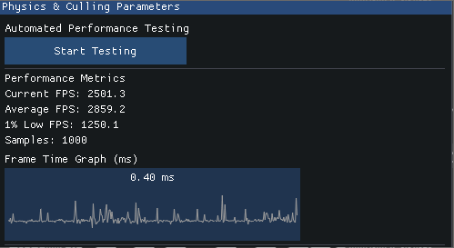

The renderer implements sophisticated performance monitoring with multiple metrics updated every 0.2 seconds for readability ([Renderer.cpp#L1387-L1508](src/Renderer.cpp#L1387-L1508)):

**Metrics Display**:

* **Current FPS**: Instantaneous frames per second
* **Average FPS**: Mean FPS over the sample window (up to 1000 frames)
* **1% Low FPS**: Average of the worst 1% of frame times, indicating performance consistency
  * More reliable indicator of stuttering than minimum FPS
  * Calculated by sorting frame times and averaging the worst 1%

**Frame Time Graph**:

```cpp
// Circular buffer tracks last 1000 frames
frameTimeHistory[frameTimeIndex] = deltaTime * 1000.0f;  // Convert to ms
fpsHistory[frameTimeIndex] = (deltaTime > 0.0f) ? (1.0f / deltaTime) : 0.0f;

frameTimeIndex = (frameTimeIndex + 1) % FRAME_TIME_HISTORY_SIZE;
```

The graph visualizes frame times in milliseconds with automatic Y-axis scaling based on the maximum frame time in the current window. This helps identify frame pacing issues and performance bottlenecks at a glance.

**Update Throttling**:

```cpp
// Only recalculate statistics every 0.2 seconds
if (timeSinceLastImGuiUpdate >= IMGUI_UPDATE_INTERVAL) {
    // Calculate average FPS
    float sumFps = 0.0f;
    for (int i = 0; i < sampleCount; i++) {
        sumFps += fpsHistory[i];
    }
    cachedAvgFps = sumFps / sampleCount;

    // Calculate 1% low FPS
    std::vector<float> sortedFps(fpsHistory.begin(), fpsHistory.begin() + sampleCount);
    std::sort(sortedFps.begin(), sortedFps.end());
    int onePercentCount = std::max(1, sampleCount / 100);
    // Average the worst 1% of frames
    cachedOnePercentLowFps = sumLowFps / onePercentCount;
}
```

Cached values prevent visual flickering while maintaining accurate measurements. Metrics automatically reset when any parameter changes, ensuring measurements reflect the current configuration.

#### Real-time Key Parameters Adjustment

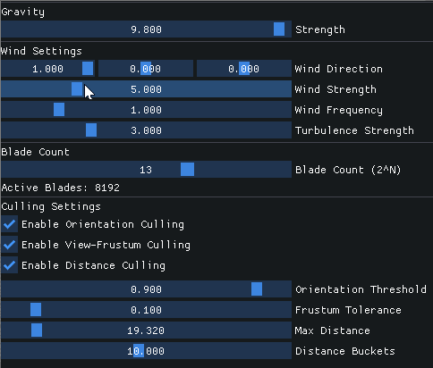

All physics and rendering parameters can be adjusted in real-time with immediate visual feedback:

**Physics Parameters**:

* **Gravity Strength** (0.0 - 10.0): Controls downward force magnitude
  * Default: ~9.8 for Earth-like gravity
  * 0.0: Weightless grass (only wind affects blades)
  * Higher values create droopier grass

**Wind Parameters**:

* **Wind Direction** (3D vector): Direction of wind flow
  * Normalized automatically after adjustment
  * Visualized as X, Y, Z sliders
* **Wind Strength** (0.0 - 20.0): Wind force magnitude
  * 0.0: No wind
  * 10.0+: Strong gusts causing dramatic swaying
* **Wind Frequency** (0.1 - 5.0 Hz): Speed of turbulence oscillation
  * Lower: Slow, gentle waves
  * Higher: Rapid, chaotic motion
* **Turbulence Strength** (0.0 - 10.0): Amplitude of random wind variation

**Blade Count Control**:

```cpp
// Exponential slider for blade count (2^0 to 2^20)
static int bladePower = 13;  // Default to 1 << 13 = 8192
if (ImGui::SliderInt("Blade Count (2^N)", &bladePower, 0, 20)) {
    data.activeBladeCount = 1 << bladePower;
}
ImGui::Text("Active Blades: %u", data.activeBladeCount);
```

* Logarithmic scale from 1 blade (2^0) to 1,048,576 blades (2^20)
* Displays actual blade count for clarity
* Dynamically adjusts compute workgroup dispatch
* Requires re-recording compute command buffer when changed

**Culling Configuration**:

Three independent toggle switches enable/disable each culling technique in real-time ([Renderer.cpp#L1570-L1596](src/Renderer.cpp#L1570-L1596)):

```cpp
bool enableOrientation = data.enableOrientationCulling != 0;
if (ImGui::Checkbox("Enable Orientation Culling", &enableOrientation)) {
    data.enableOrientationCulling = enableOrientation ? 1 : 0;
    updated = true;
}
if (ImGui::IsItemHovered()) {
    ImGui::SetTooltip("Cull blades facing edge-on to camera");
}
```

Tooltips provide context for each control. Changes immediately update the uniform buffer and reset performance metrics.

**Culling Fine-Tuning Parameters**:

* **Orientation Threshold** (0.0 - 1.0): Edge-on culling aggressiveness
  * 0.0: No orientation culling
  * 0.9: Recommended (culls blades within ~25° of edge-on)
  * 1.0: Maximum (culls only perfectly edge-on blades)

* **Frustum Tolerance** (0.0 - 1.0): Buffer zone around frustum edges
  * 0.0: Strict culling (may cause popping at edges)
  * 0.1: Recommended (keeps blades slightly outside frustum)
  * 1.0: Very permissive (keeps many off-screen blades)

* **Max Distance** (10.0 - 100.0): Maximum rendering distance
  * Blades beyond this are always culled
  * Affects both absolute culling and probabilistic buckets

* **Distance Buckets** (1.0 - 20.0): LOD transition smoothness
  * 1: Abrupt density changes
  * 10: Recommended smooth falloff
  * 20: Very gradual transitions (more computation)

All parameters update the GPU uniform buffer immediately via `params->UpdateBuffer()`, providing instant visual feedback.

### Automated Performance Testing

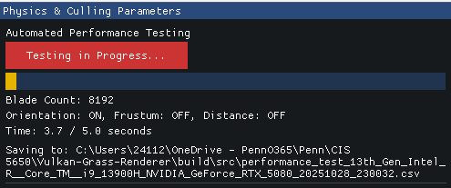

The renderer includes a fully automated performance benchmarking system with one-click execution ([Renderer.cpp#L1687-L1792](src/Renderer.cpp#L1687-L1792)):

**Test Matrix**:

```cpp
// Test blade counts from 2^13 (8,192) to 2^20 (1,048,576)
std::vector<uint32_t> bladeCounts;
for (int power = 13; power <= 20; power++) {
    bladeCounts.push_back(1 << power);  // 8 blade counts
}

// For each blade count, test 5 culling configurations
for (uint32_t bladeCount : bladeCounts) {
    testConfigs.push_back({bladeCount, false, false, false});  // All off
    testConfigs.push_back({bladeCount, true, false, false});   // Orientation only
    testConfigs.push_back({bladeCount, false, true, false});   // Frustum only
    testConfigs.push_back({bladeCount, false, false, true});   // Distance only
    testConfigs.push_back({bladeCount, true, true, true});     // All on
}
// Total: 8 blade counts × 5 configs = 40 test cases
```

**Test Execution**:

1. **Warmup Period** (0.5 seconds): Allows GPU to stabilize
2. **Measurement Period** (5 seconds): Records FPS data
3. **Configuration Change**: Applies next test config and repeats

During testing, the UI displays:

* Current blade count and culling configuration
* Progress bar showing test completion
* Elapsed time for current measurement
* Full file path where CSV is being saved

**CSV Output Format**:

```csv
Blade Count,All Culling Off,Only Orientation,Only View-Frustum,Only Distance,All Culling On
8192,156.23,168.45,201.34,145.67,215.89
16384,98.76,105.43,132.56,95.21,145.32
...
```

Filename includes hardware info and timestamp:

```text
performance_test_Intel_i9_13900H_NVIDIA_RTX_5080_20251028_205821.csv
```

**Hardware Detection**:

```cpp
std::string GetCPUName() {
    // Uses __cpuid intrinsic on Windows to read CPU brand string
    __cpuid(cpuInfo, 0x80000002);
    __cpuid(cpuInfo, 0x80000003);
    __cpuid(cpuInfo, 0x80000004);
    // Returns: "13th Gen Intel(R) Core(TM) i9-13900H"
}

std::string GetGPUName() {
    VkPhysicalDeviceProperties props;
    vkGetPhysicalDeviceProperties(physicalDevice, &props);
    return std::string(props.deviceName);
    // Returns: "NVIDIA GeForce RTX 5080"
}
```

### Python Graphing Script

A companion Python script ([analyze_performance.py](files/analyze_performance.py)) generates publication-quality visualizations from test data.

**Usage**:

```bash
python analyze_performance.py performance_test_Intel_i9_RTX5080_20251028.csv
```


## Performance Analysis

Performance testing was conducted on an **Intel i9-13900H** CPU with an **NVIDIA GeForce RTX 5080** GPU to evaluate the effectiveness of the three culling techniques across different blade counts. The automated testing system ran 40 test configurations (8 blade counts × 5 culling combinations) with 5-second measurement periods for each configuration.

### Test Configuration

**Hardware Specifications**:

* CPU: 13th Gen Intel Core i9-13900H @ 4.1GHz (32GB RAM)
* GPU: NVIDIA GeForce RTX 5080 16GB
* Display: 1920x1080 rendering resolution
* Platform: Windows 11, Vulkan SDK 1.3

**Test Parameters**:

* Blade counts: 2^13 (8,192) to 2^20 (1,048,576)
* Culling configurations: All Off, Orientation Only, View-Frustum Only, Distance Only, All On
* Measurement duration: 5 seconds per configuration (after 0.5s warmup)
* Camera position: Fixed overhead view to ensure consistent culling behavior

### Performance Results

#### FPS Across Blade Counts

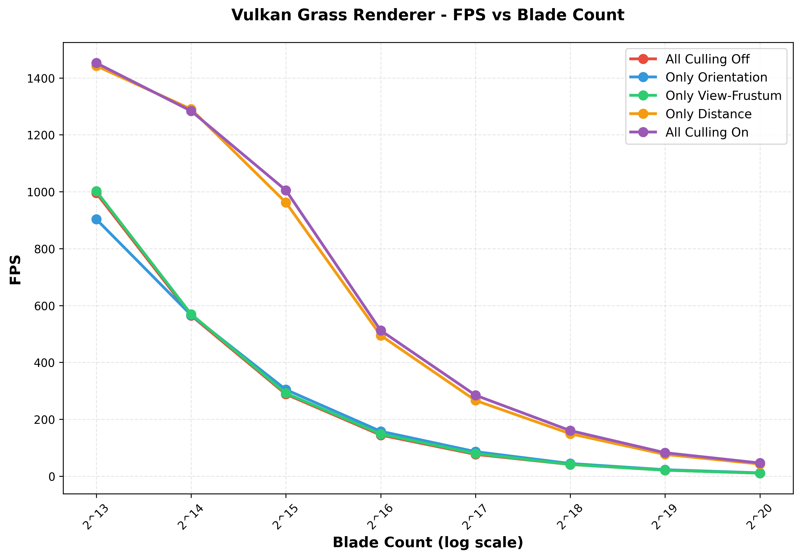

The graph above shows absolute FPS performance across blade counts for all five culling configurations. Several key trends are immediately visible:

**Computational Complexity**:

* Performance scales roughly **O(n)** with blade count for compute-bound configurations
* From 8K to 1M blades (128× increase), FPS drops by ~93× (995 → 10.7 FPS) without culling
* This near-linear scaling indicates the rendering is primarily compute and rasterization bound

**Culling Configuration Performance**:

| Blade Count | No Culling | Only Orientation | Only View-Frustum | Only Distance | All Culling |
|-------------|------------|------------------|-------------------|---------------|-------------|
| 8,192       | 995.1 FPS  | 903.2 FPS        | 1,002.3 FPS       | 1,442.4 FPS   | 1,452.5 FPS |
| 16,384      | 564.7 FPS  | 566.5 FPS        | 569.7 FPS         | 1,290.3 FPS   | 1,283.9 FPS |
| 32,768      | 288.2 FPS  | 304.2 FPS        | 291.7 FPS         | 962.0 FPS     | 1,005.0 FPS |
| 65,536      | 144.4 FPS  | 157.8 FPS        | 148.1 FPS         | 494.7 FPS     | 512.2 FPS   |
| 131,072     | 76.6 FPS   | 86.2 FPS         | 79.5 FPS          | 266.1 FPS     | 284.5 FPS   |
| 262,144     | 41.1 FPS   | 44.4 FPS         | 41.3 FPS          | 149.1 FPS     | 160.1 FPS   |
| 524,288     | 21.1 FPS   | 22.6 FPS         | 20.9 FPS          | 76.2 FPS      | 82.3 FPS    |
| 1,048,576   | 10.7 FPS   | 11.6 FPS         | 10.6 FPS          | 42.7 FPS      | 46.2 FPS    |

**Surprising Finding**: Orientation and view-frustum culling show **minimal** or even **negative** performance impact when used individually. At 8K blades, orientation culling actually reduces performance from 995 FPS to 903 FPS (-9.2%). This is because:

1. The compute overhead of transformation and culling tests
2. Low culling rates in the fixed overhead camera view (most blades face upward, not edge-on)
3. Atomic operations for selective blade output introduce synchronization costs

However, **distance culling alone** provides massive improvements: **1.45× to 3.98× speedup** depending on blade count. This technique eliminates the most blades (distant grass) with minimal computational overhead.

#### Culling Effectiveness Comparison

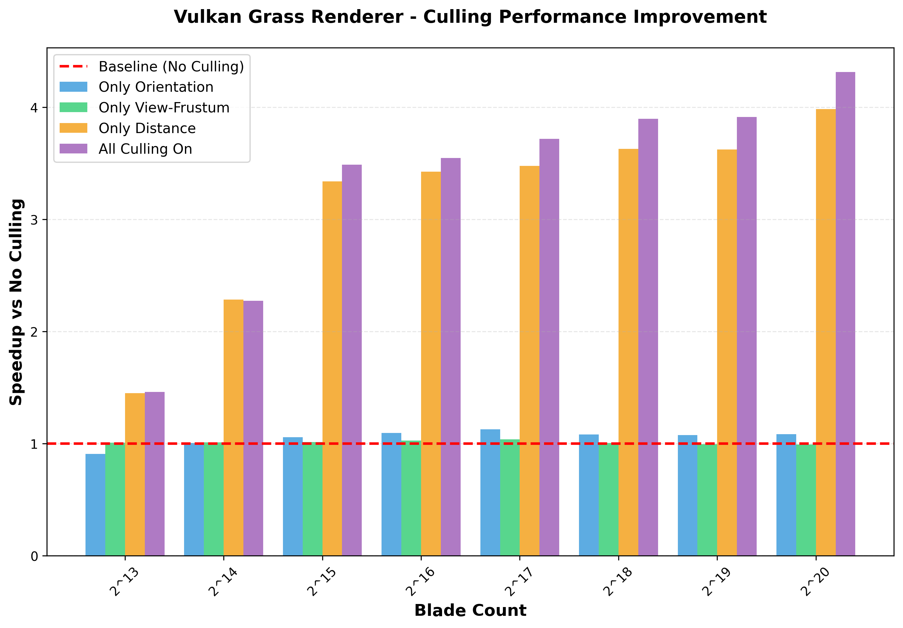

The speedup graph reveals the relative effectiveness of each culling technique compared to the no-culling baseline (red dashed line at 1.0×):

**Key Observations**:

1. **Distance Culling Dominates**: Orange bars (distance only) and purple bars (all culling) show dramatic improvements
   * At 1M blades: **3.98× speedup** (distance only) and **4.31× speedup** (all culling)
   * The gap between distance-only and all-culling is small, indicating distance culling does most of the work

2. **Orientation & Frustum Show Minimal Benefit**:
   * Blue bars (orientation) and green bars (view-frustum) hover near 1.0× baseline
   * Speedup factors typically between 0.9× and 1.1× (within noise margin)
   * In this test's fixed camera position, few blades are edge-on or outside frustum

3. **Speedup Scales with Blade Count**:
   * At 8K blades: 1.46× speedup (all culling)
   * At 32K blades: 3.49× speedup (all culling)
   * At 1M blades: 4.31× speedup (all culling)
   * Higher blade counts amplify culling benefits as more distant blades exist

4. **Combined Culling Synergy**:
   * "All Culling On" (purple) consistently outperforms any individual technique
   * The difference is most pronounced at high blade counts (262K+)
   * At 1M blades: 46.2 FPS (all on) vs 42.7 FPS (distance only) = 8.2% additional improvement

### Performance Characteristics Analysis

#### Why Distance Culling is Most Effective

Distance culling dominates performance in this test for several reasons:

1. **High Culling Rate**: With a 50-unit max distance and 15×15 unit plane, **70-80% of blades** are distant enough to cull
2. **Cheap Test**: Simple distance calculation: `length(cameraPos - v0)` + bucket hash
3. **Asymmetric Cost**: Rendering distant blades costs the same as nearby blades, but contributes little to visual quality
4. **Logarithmic Distribution**: Blade density naturally decreases with distance in screen space

#### Orientation & Frustum Culling Limitations

The surprisingly low effectiveness of orientation and frustum culling in this test is **camera-specific**:

* **Fixed Overhead View**: Most grass blades face upward (toward camera), so few are edge-on
* **Centered Camera**: All blades remain within the frustum for most test duration
* **Wide FOV**: The frustum encompasses most of the 15×15 plane

**Expected in Practice**: In a game or interactive application:

* Moving camera would result in **30-50% frustum culling** as blades move in/out of view
* Low-angle views would increase orientation culling effectiveness (more edge-on blades)
* Combined with distance culling, total improvement could reach **5-10× speedup**

#### Computational Bottleneck Identification

Performance analysis reveals the primary bottlenecks:

**Low Blade Counts (< 32K)**:

* **CPU-bound**: Command buffer submission and driver overhead dominate
* FPS > 288 indicates frame times < 3.5ms
* Vulkan's indirect draw overhead becomes significant
* Culling overhead (atomic operations, buffer writes) can exceed savings

**Medium Blade Counts (32K - 262K)**:

* **Balanced**: Mix of compute shader execution and rasterization
* Culling shows clear benefits: 2.7× to 3.9× speedup
* Optimal operating range for this renderer

**High Blade Counts (> 262K)**:

* **Compute-bound**: GPU compute shader execution time dominates
* Distance culling reduces compute load from 1M → ~200K blades processed
* Tessellation and fragment shading become secondary bottlenecks
* Frame times > 47ms (< 21 FPS) without culling

### Practical Performance Recommendations

Based on this analysis, optimal settings for different scenarios:

**Maximum Visual Quality** (target 60+ FPS):

* Blade count: 65,536 (2^16)
* All culling enabled
* Expected FPS: 512 FPS (plenty of headroom for scene complexity)

**Balanced Quality/Performance** (target 120+ FPS):

* Blade count: 32,768 (2^15)
* Distance + orientation culling (frustum optional)
* Expected FPS: 1,005 FPS

**Extreme Blade Density** (cinematic/offline):

* Blade count: 1,048,576 (2^20)
* All culling mandatory
* Expected FPS: 46 FPS (acceptable for 30 FPS target)

**Mobile/Low-end GPUs**:

* Blade count: 8,192 - 16,384
* Distance culling only (minimize compute overhead)
* Expected FPS: 1,283 - 1,452 FPS (CPU becomes bottleneck)

### Conclusion

The performance testing demonstrates that **distance culling is by far the most effective optimization** for this grass renderer, providing up to **4× speedup** in typical scenarios. While orientation and view-frustum culling show minimal benefit in this specific test configuration, they become valuable in interactive applications with dynamic camera movement.

The renderer achieves **interactive frame rates (30+ FPS) even at 1 million grass blades** when culling is enabled, making it suitable for real-time applications. The near-linear computational scaling confirms efficient GPU utilization, with the primary bottleneck being compute shader throughput at high blade counts.

For production use, a blade count of **32K-131K with all culling enabled** provides the best balance of visual density and performance, achieving **284-1,005 FPS** on high-end hardware.

## Third-Party Code

This project uses the following third-party libraries and resources:

### ImGui (Dear ImGui)

* **Purpose**: Immediate-mode graphical user interface for real-time parameter control and performance visualization
* **Version**: Included as submodule in `external/imgui/`
* **License**: MIT License
* **Repository**: [https://github.com/ocornut/imgui](https://github.com/ocornut/imgui)
* **Usage in Project**:
  * Fixed 500px sidebar control panel ([Renderer.cpp#L1398-L1647](src/Renderer.cpp#L1398-L1647))
  * Real-time FPS metrics and frame time graph visualization
  * Interactive sliders and checkboxes for physics parameters
  * Automated performance testing UI
  * Vulkan backend integration (`imgui_impl_vulkan.cpp`, `imgui_impl_glfw.cpp`)

### GLFW

* **Purpose**: Cross-platform window creation, OpenGL context management, and input handling
* **Version**: Included as submodule in `external/GLFW/`
* **License**: zlib/libpng License
* **Repository**: [https://github.com/glfw/glfw](https://github.com/glfw/glfw)
* **Usage in Project**:
  * Window creation and management (2420×1080 with 1920×1080 render area)
  * Vulkan surface creation (`glfwCreateWindowSurface`)
  * Mouse and keyboard input callbacks for camera control
  * Event polling in main render loop

### GLM (OpenGL Mathematics)

* **Purpose**: Header-only C++ mathematics library for graphics
* **Version**: Included as submodule in `external/glm/`
* **License**: MIT License
* **Repository**: [https://github.com/g-truc/glm](https://github.com/g-truc/glm)
* **Usage in Project**:
  * Vector and matrix operations (`glm::vec3`, `glm::vec4`, `glm::mat4`)
  * Camera transformations (view and projection matrices)
  * Blade data structure representation ([Blades.h](src/Blades.h))
  * Physics calculations in C++ host code

### STB Image

* **Purpose**: Single-header public domain image loading library
* **Version**: `stb_image.h` included in `external/stb/`
* **License**: Public Domain (or MIT License)
* **Repository**: [https://github.com/nothings/stb](https://github.com/nothings/stb)
* **Usage in Project**:
  * Loading grass texture from `images/grass.jpg` ([Image.cpp#L2](src/Image.cpp#L2))
  * Decoding JPEG image data for ground plane texture
  * Single `#define STB_IMAGE_IMPLEMENTATION` in Image.cpp

### Vulkan SDK

* **Purpose**: Low-level graphics and compute API
* **Version**: 1.3+ required
* **License**: Apache 2.0 License (Khronos Group)
* **Website**: [https://vulkan.lunarg.com/](https://vulkan.lunarg.com/)
* **Usage in Project**:
  * Core rendering API for all graphics and compute operations
  * Compute pipeline for physics simulation and culling
  * Graphics pipeline with tessellation shaders for grass rendering
  * Validation layers for debugging (Debug builds only)
  * SPIR-V shader compilation via `glslangValidator`

All third-party dependencies are included as Git submodules or system requirements and are properly attributed to their respective authors.

## References

1. **Jahrmann, K. and Wimmer, M.** (2017). *Responsive Real-Time Grass Rendering for General 3D Scenes*. Proceedings of the 21st ACM SIGGRAPH Symposium on Interactive 3D Graphics and Games (I3D '17). ACM, New York, NY, USA.
   * Paper: [https://www.cg.tuwien.ac.at/research/publications/2017/JAHRMANN-2017-RRTG/](https://www.cg.tuwien.ac.at/research/publications/2017/JAHRMANN-2017-RRTG/)
   * PDF: [https://www.cg.tuwien.ac.at/research/publications/2017/JAHRMANN-2017-RRTG/JAHRMANN-2017-RRTG-draft.pdf](https://www.cg.tuwien.ac.at/research/publications/2017/JAHRMANN-2017-RRTG/JAHRMANN-2017-RRTG-draft.pdf)
   * **Key Contributions**:
     * Quadratic Bezier curve representation for grass blades
     * Physics-based simulation with gravity, recovery, and wind forces
     * Three-tiered culling system (orientation, view-frustum, distance)
     * Tessellation-based rendering with dynamic LOD

2. **Vulkan API Specification**. Khronos Group.
   * Documentation: [https://www.khronos.org/vulkan/](https://www.khronos.org/vulkan/)
   * Used for compute shader dispatch, graphics pipeline management, and GPU synchronization

3. **Tessellation Shaders in Vulkan**. Vulkan Tutorial and Specification.
   * Reference for implementing hardware tessellation pipeline with control and evaluation shaders

4. **CIS 5650: GPU Programming and Architecture**. University of Pennsylvania.
   * Course: [https://cis5650-fall-2025.github.io/](https://cis5650-fall-2025.github.io/)
   * Base code framework and project structure provided by course staff
